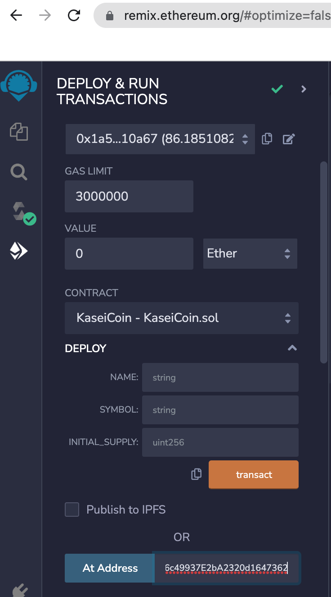

# Unit 21: Martian Token Crowdsale

## Background

Developing a monetary system for the new Mars colony based on blockchain technology and define a new cryptocurrency named **KaseiCoin**. (Kasei means Mars in Japanese.)

KaseiCoin will be a fungible token that’s ERC-20 compliant. Launch a crowdsale that will allow people who are moving to Mars to convert their earthling money to KaseiCoin.

## Instructions

The steps for this assignment are divided into the following subsections:

1. Create the KaseiCoin Token Contract

2. Create the KaseiCoin Crowdsale Contract

3. Create the KaseiCoin Deployer Contract

4. Deploy and Test the Crowdsale on a Local Blockchain

Note that the provided starter files for this homework assignment contain a `pragma` statement for Solidity version 0.5.0. 
However, there were errors compiling the files with compiler version 0.5.0 and version 0.5.5 was used to compile.

Created a fungible token that’s ERC-20 compliant and minted by using a `Crowdsale` contract from the OpenZeppelin Solidity library.

The crowdsale contract thus created will manage the entire crowdsale process. 
This process will allow users to send ether to the contract and receive KaseiCoin tokens, or **KAI**, in return.
The contract will automatically mint the tokens and distribute them to a buyer in one transaction.

### Compile KaseiCoin Token Contract

-
		
### Compile KaseiCrowdsale  Contract
					
-
	
### Compile KaseiCrowdsale Deployer Contract
	
-

### Select the Injective-Metamask as provider
		
-
		
### Deploy and confirm transaction in Metamask
		
-

### Check if deployment is success

-

###  Get address of KaseiCoin contract and KaseiCoinCrowdsale contract from public variables in deployer contract

-

###  Check initial balances in Ganache accounts

-

###  Verify balance in Metamask connected to Ganache local blockchain

-

###  Load crowdsale contract using address from deployer public variable

-

###  Load KaseiCoin contract using adddress from deployer public variable

-

###  Buy tokens using loaded crowdsale using buyToken button

-
					
###  Confirm token purchased					

-
		
###  Load KaseiCoin contract using address from crowdsale contract							

-
					
###  Verify total coins associated with account	

-

### Link to the video on youtube that provides an overview of the application

---
### The screen recording is also checked in the repo and the name of the file is is ScreenRecording_18_BlockChain.mov

